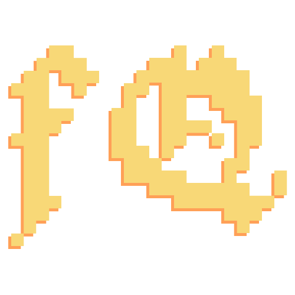

<a id="readme-top"></a>

[![Contributors][contributors-shield]][contributors-url]
[![Forks][forks-shield]][forks-url]
[![Stargazers][stars-shield]][stars-url]
[![Issues][issues-shield]][issues-url]
[![MIT][license-shield]][license-url]

<!-- PROJECT LOGO -->
<br />
<div align="center">
  <a href="https://github.com/DraDN/FlashQuest">
    
  </a>

<h3 align="center">FlashQuest</h3>

  <p align="center">
    A rouge-like gamified flashcard learning tool
    <br />
    <!-- <a href="https://github.com/DraDN/FlashQuest"><strong>Explore the docs »</strong></a> -->
    <a href="https://flashquest.dradn.com"><b>View live product now »</b></a>
    <br />
    <br />
    <!-- <a href="https://flashquest.dradn.com">View live product</a> -->
    <!-- &middot; -->
    <a href="https://github.com/DraDN/FlashQuest/issues/new?labels=bug&template=bug-report---.md">Report Bug</a>
    &middot;
    <a href="https://github.com/DraDN/FlashQuest/issues/new?labels=enhancement&template=feature-request---.md">Request Feature</a>
  </p>
</div>

<!-- TABLE OF CONTENTS -->
<details>
  <summary>Table of Contents</summary>
  <ol>
    <li>
      <a href="#about-the-project">About The Project</a>
      <ul>
        <li><a href="#built-with">Built With</a></li>
      </ul>
    </li>
    <li>
      <a href="#getting-started">Getting Started</a>
      <ul>
        <li><a href="#prerequisites">Prerequisites</a></li>
        <li><a href="#installation">Installation</a></li>
      </ul>
    </li>
    <li><a href="#usage">Usage</a></li>
    <li><a href="#roadmap">Roadmap</a></li>
    <li><a href="#license">License</a></li>
  </ol>
</details>


<!-- ABOUT THE PROJECT -->
## About The Project

[![Product Name Screen Shot][product-screenshot]](https://example.com)

FlashQuest is a gamified learning tool that turns flashcard study sessions 
into a roguelike RPG experience. Create decks of flashcards on any topic, 
then enter procedurally generated dungeons. Fight enemies by 
answering correctly, or be defeated by wrong answers that cost you HP.

<!-- Built as a computer science final project, FlashQuest combines spaced  -->
<!-- repetition memory science with RPG progression mechanics to make studying  -->
<!-- genuinely engaging. -->

**Key Features:**
- Create and manage flashcard decks on any topic
- Enter dungeons and battle enemies with your knowledge
- Easy drag and drop gameplay that works on both desktop and mobile
- Earn XP and level up your decks as you study
- Have fun while studying!
<!-- - Spaced repetition scheduling ensures you review cards at the right time -->

<p align="right">(<a href="#readme-top">back to top</a>)</p>


### Built With

* [![React][React.js]][React-url]
* [![Vite][Vite]][Vite-url]
* [![TailwindCSS][Tailwind]][Tailwind-url]
* [![Node.js][Node]][Node-url]
* [![Express][Express]][Express-url]
* [![SQLite][SQLite]][SQLite-url]
* [![Docker][Docker]][Docker-url]
* [![Clerk][Clerk]][Clerk-url]

<p align="right">(<a href="#readme-top">back to top</a>)</p>


<!-- GETTING STARTED -->
## Getting Started

To get a local copy up and running follow these simple example steps.

### Prerequisites

You'll need a Docker environment to easily launch this project.

### Installation

1. Clone the repo
   ```sh
   git clone https://github.com/DraDN/FlashQuest.git
   ```
2. Duplicate the `.env.example` file and rename it to `.env.dev` (for local development) or `.env.prod` (for production)
3. Get a free Clerk API Key at [https://clerk.com](https://clerk.com)
4. Enter your Clerk Key in `.env.dev` (for development key) or `.env.prod` (for live key)
   ```js
   VITE_CLERK_PUBLISHABLE_KEY='ENTER YOUR API'
   ```
5. Change the other environment variables, or leave them default for local development
6. Change git remote url to avoid accidental pushes to base project
   ```sh
   git remote set-url origin https://github.com/your_github_username/your_repo.git
   git remote -v # confirm the changes
   ```
7. Launch the project by running the custom script provided
   ```sh
   chmod +x ./start.sh # give run permission to script
   ./start.sh dev # to launch in the development environment
   # or
   ./start.sh prod # to launch in the production environment
   ```

<p align="right">(<a href="#readme-top">back to top</a>)</p>


<!-- USAGE EXAMPLES -->
## Usage

The best way to experience FlashQuest is to [try the live version](https://flashquest.dradn.com).

### Basic Flow

1. **Create a deck** — add a deck for any topic you want to study
2. **Add flashcards** — fill it with question and answer pairs
3. **Create a dungeon** — select one or more decks to pool into a dungeon
4. **Battle** — drag cards from your hand and drop them onto enemies. 
   A modal will ask you the question — answer correctly to deal damage, 
   wrong answers cost you HP
5. **Level up** — correct answers earn XP for each deck used in the dungeon

<p align="right">(<a href="#readme-top">back to top</a>)</p>


<!-- ROADMAP -->
## Roadmap

- [x] Security overhaul
- [ ] Enemy system rewrite + more enemeies
- [ ] Spaced Repetition function
- [ ] CSV import / export of decks
- [ ] Leaderboards

See the [open issues](https://github.com/DraDN/FlashQuest/issues) for a full list of proposed features (and known issues).

<p align="right">(<a href="#readme-top">back to top</a>)</p>


<!-- CONTRIBUTING -->
## Contributing

Contributions are what make the open source community such an amazing place to learn, inspire, and create. Any contributions you make are **greatly appreciated**.

If you have a suggestion that would make this better, please fork the repo and create a pull request. You can also simply open an issue with the tag "enhancement".
Don't forget to give the project a star! Thanks again!

1. Fork the Project
2. Create your Feature Branch (`git checkout -b feature/AmazingFeature`)
3. Commit your Changes (`git commit -m 'Add some AmazingFeature'`)
4. Push to the Branch (`git push origin feature/AmazingFeature`)
5. Open a Pull Request

<p align="right">(<a href="#readme-top">back to top</a>)</p>


<!-- LICENSE -->
## License

Distributed under the <b>MIT License</b>. See `LICENSE.txt` for more information.

<p align="right">(<a href="#readme-top">back to top</a>)</p>


<!-- MARKDOWN LINKS & IMAGES -->
[contributors-shield]: https://img.shields.io/github/contributors/DraDN/FlashQuest.svg?style=for-the-badge
[contributors-url]: https://github.com/DraDN/FlashQuest/graphs/contributors
[forks-shield]: https://img.shields.io/github/forks/DraDN/FlashQuest.svg?style=for-the-badge
[forks-url]: https://github.com/DraDN/FlashQuest/network/members
[stars-shield]: https://img.shields.io/github/stars/DraDN/FlashQuest.svg?style=for-the-badge
[stars-url]: https://github.com/DraDN/FlashQuest/stargazers
[issues-shield]: https://img.shields.io/github/issues/DraDN/FlashQuest.svg?style=for-the-badge
[issues-url]: https://github.com/DraDN/FlashQuest/issues
[license-shield]: https://img.shields.io/github/license/DraDN/FlashQuest.svg?style=for-the-badge
[license-url]: https://github.com/DraDN/FlashQuest/blob/main/LICENSE
[product-screenshot]: images/screenshot_flashquest_use.png

[React.js]: https://img.shields.io/badge/React-20232A?style=for-the-badge&logo=react&logoColor=61DAFB
[React-url]: https://reactjs.org/
[Vite]: https://img.shields.io/badge/Vite-646CFF?style=for-the-badge&logo=vite&logoColor=white
[Vite-url]: https://vitejs.dev/
[Tailwind]: https://img.shields.io/badge/Tailwind_CSS-38B2AC?style=for-the-badge&logo=tailwind-css&logoColor=white
[Tailwind-url]: https://tailwindcss.com/
[Node]: https://img.shields.io/badge/Node.js-43853D?style=for-the-badge&logo=node.js&logoColor=white
[Node-url]: https://nodejs.org/
[Express]: https://img.shields.io/badge/Express-000000?style=for-the-badge&logo=express&logoColor=white
[Express-url]: https://expressjs.com/
[SQLite]: https://img.shields.io/badge/SQLite-07405E?style=for-the-badge&logo=sqlite&logoColor=white
[SQLite-url]: https://sqlite.org/
[Docker]: https://img.shields.io/badge/Docker-2496ED?style=for-the-badge&logo=docker&logoColor=white
[Docker-url]: https://docker.com/
[Clerk]: https://img.shields.io/badge/Clerk-6C47FF?style=for-the-badge&logo=clerk&logoColor=white
[Clerk-url]: https://clerk.com/
